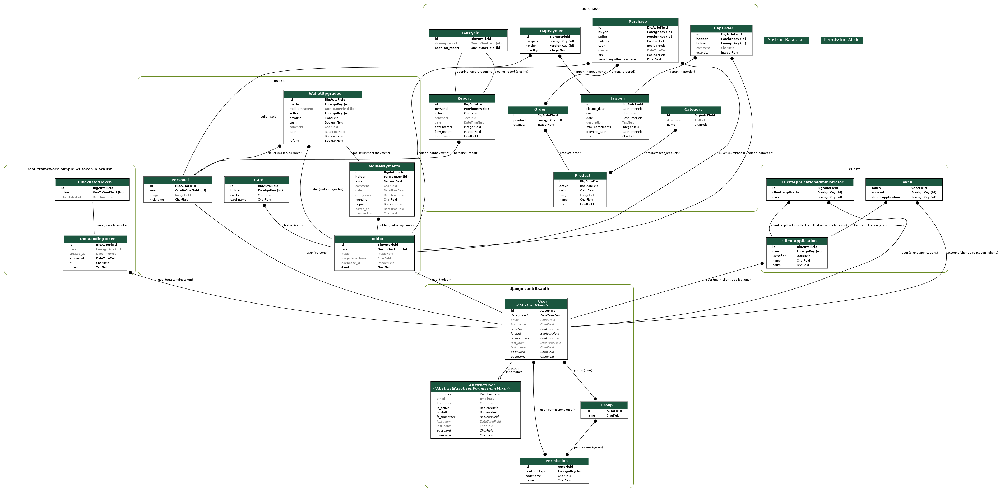

# Mamon Backend and Application 

## Info

This is the Mono Repo for the mamon application and backend. This readme gives you a general overview of the whole project(I think), further information is available in the backend/README and the app/README files, depending on what you want to know/what you want to develop. If there is anything that is unclear please feel free to text me and let me know (my contact is under the authors section futher down).

## Contributing
If you commit to master it will release the CI/CD runner which builds the application and releases it to the app store, therefore we only do merge requests. that way be build the app only a few times with expo rather every time we commit something.

So, if you want to add something you build it locally and create a branch with the title as the main thing you are adding. In this merge request you specify specifically what you are trying to do and how you are trying to do it if it is not self explanatory!

## Collaborate with your team

- [ ] [Create a new merge request](https://docs.gitlab.com/ee/user/project/merge_requests/creating_merge_requests.html)
- [ ] [Automatically close issues from merge requests](https://docs.gitlab.com/ee/user/project/issues/managing_issues.html#closing-issues-automatically)
- [ ] [Enable merge request approvals](https://docs.gitlab.com/ee/user/project/merge_requests/approvals/)
- [ ] [Automatically merge when pipeline succeeds](https://docs.gitlab.com/ee/user/project/merge_requests/merge_when_pipeline_succeeds.html)

## Authors and acknowledgment
1. [Gustavo Maduro Vollmer](https://esrtheta.nl/leden/profiel/3169) owner of the project, active contributer from august 2022 until --

## License and Copy Write
This project is not open source and not licensed, copywrite belongs to the authors mentioned above from their starting date and is relative to their contributions.

## History

After realising that bacchus was pretty old and that nobody from the wwwcie really work with it I (Gustavo) decided to try to rebuild it but in languages that we knew and could work with. I built the backend in python using Django and built the application in Typescript using React Native. The development process was simple, come up with a proof of concept for the backend and make sure it could work and then build the application. The main idea was to first replicate bacchus and then to start adding things to it. Everything in both projects is fully self coded and there are some concepts that are taken from other E.S.R. Thêta repos to make sure people would have something to look fall back on if they needed it.  

## The MonoRepo

Mamon is made in a mono repo, this means that the git repo holds 2 or projects that work together, the idea of this is to keep it centralized and that everything always works together. There are 3 files that are important to understand this monorepo: `Pipfile`, `docker-compose.yml`, ` .gitlab-ci.yml``.gitlab-ci.yml `.

#### `Pipfile` and Pipenv

Pipenv creates a virtual python enviroment for us to use. It creates the pipfile and when in a `pipenv shell `or when using `pipenv run [command]`, it will load environment variables in the `.env` file.
The Pipfile is for the python side of this code. It helps with intellisence and with module recognition as well as letting us predefine commands that we use regularly. More explanation about this file is available within the backend README.

#### `docker-compose.yml`

This file is responsible for building the app locally within docker. It creates a postgres database and an instance of the backend within a docker file. If you make changes to this file like adding an environment variable you have to stop the docker container and restart it for it to have effect.

#### `.gitlab-ci.yml`.

This file does nothing on your computer, but it handles a lot of annoying things once you commit it to gitlab. There are 3 of these files within the whole repo: `.gitlab-ci.yml`,`backend/.gitlab-ci.yml`,`app/.gitlab-ci.yml`.

##### `.gitlab-ci.yml`

This file creates triggers. Essentially, if there are changes within app or backend folder it will trigger those folders CI/CD. This is usefull to not be deploying the backend every time something is pushed for the application or to not build the app again everytime you push something for the backend.

##### `backend/.gitlab-ci.yml`

This runs the tests for the backend and then deploys it to metis. If you merge or commit to the development branch it will deploy it to `staging-mamon.esrtheta.nl`, if you do it to master it will push it `mamon.esrtheta.nl`. Again, this will only happen when there are changes to the backend folder.

##### `app/.gitlab-ci.yml`

This file is responsible for the building and submiting of the application to the app stores. If you change anything in the app and push it to master it will build the applications with EAS build(`npx eas build`) and if the apps are successfully built for android or for IOS it will be submitted to the respective store. This process is dependent on how busy the expo servers are but it usually takes 15-30 minutes.

## Extra things

in the .env file you can define local or secret variables, that shouldn't be displayed in your code.

pipfile.lock: do not touch, specification of used packages in the project.

## UML Graph

## Plan for implementation 
